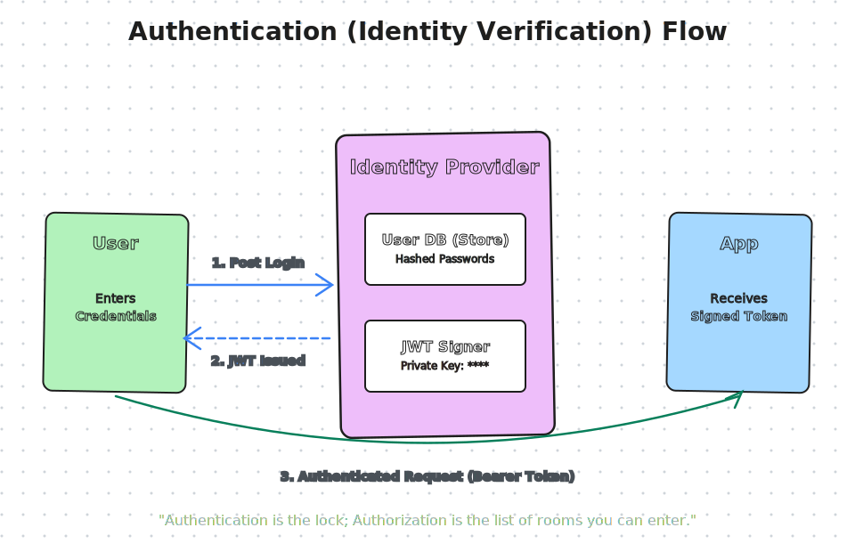

# Authentication

---

## Authentication : Verifies that the person or system trying to access your app is legit

### How modern apps handle authentication
 - Basic Authentication
 - Bearer Tokens
 - OAuth2 Authentication (Technically: OAuth 2.0 Authorization + OpenID Connect (authentication))
 - JWT Tokens
 - Access and Refresh Tokens
 - Single Sign-On (SSO) and Identity Protocols
 
 
 ## What is authentication?
 
  Authentication = Who are you?
  
  ### First Step before authorization
  
  `Login Request -> User Identity Confirmed -> Authorization (Next Step)`
  
  Before you can access data or perform actions the system needs to know who you are
  

## Basic Authentication

Username + Password 

Basic base64(Username + Password )

`Login Request` -> `base64(Username + Password )`

base64 encoded: Simple encoding that's easily reversible

## Bearer Token Authentication

Bearer<access_token>