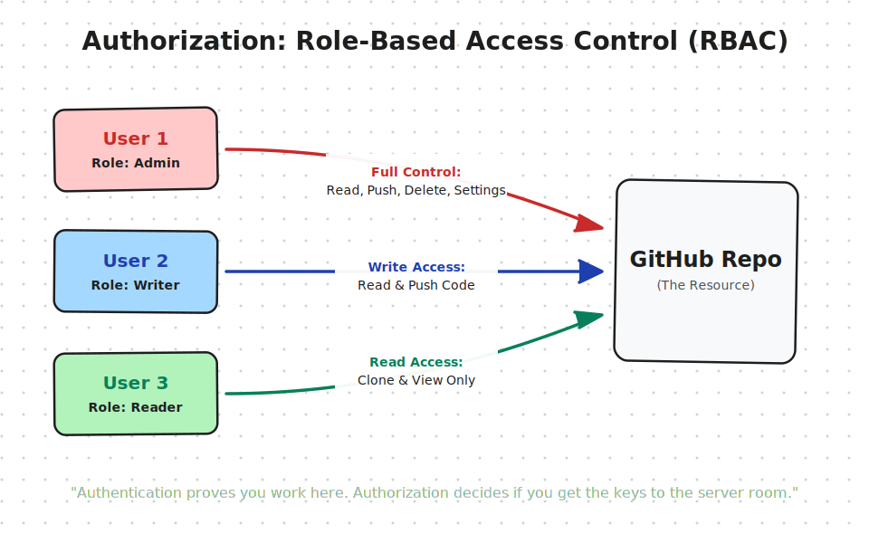
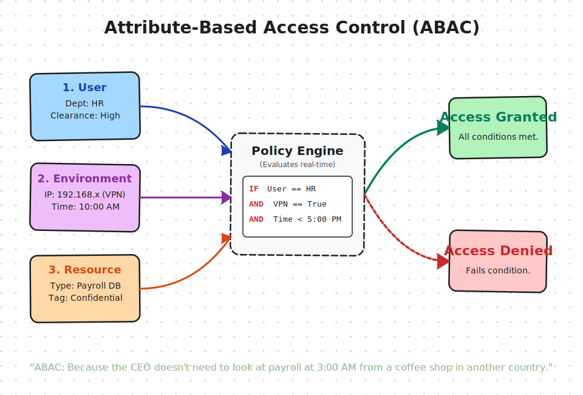

# Authorization


---

## How applications manage permissions 
- RBAC (Role-Based Access Control)
- ABAC (Attribute Based Access Control)
- ACL (Access Control List)
+ How OAuth2 and JWTs help enforce those rules 

###  RBAC (Role-Based Access Control)




### ABAC (Attribute Based Access Control)

Three pillars:

- User Attributes (Who - Department, Job title, Age)
- Environment Attributes (Context - Time of day, IP Address, Device and Network Type)
- Resource Attributes (What - Document Classification)


"Admins can view Payroll," an ABAC policy looks like this:

ALLOW ACCESS IF:

```
(User.Department == "HR") AND
(Resource.Classification == "Confidential") AND
(Environment.Network == "Company_VPN") AND
(Environment.Time == "09:00 - 17:00")
```



