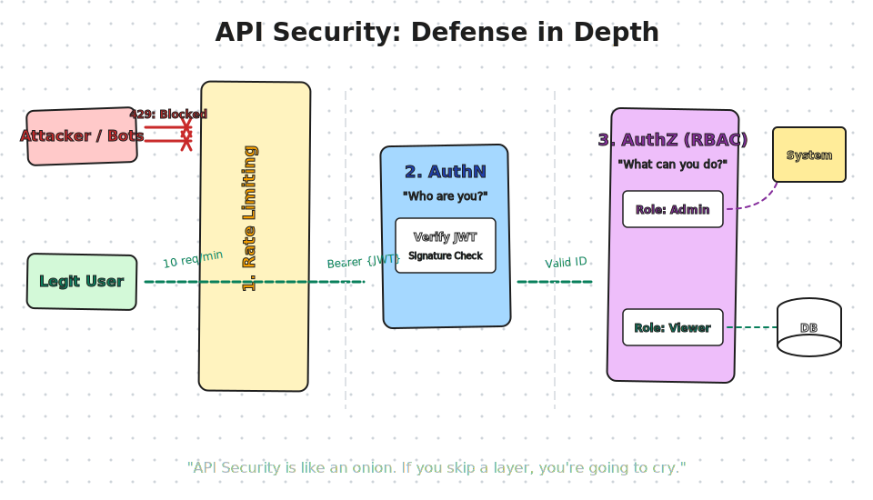
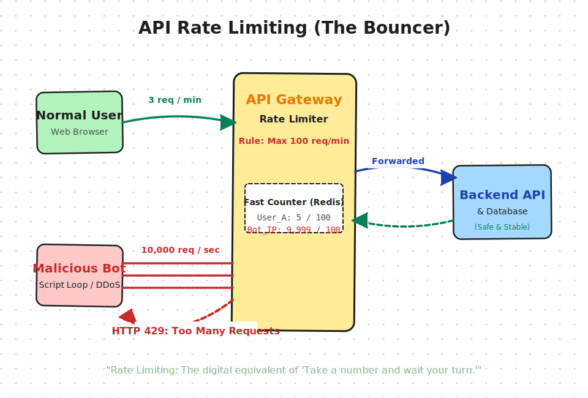

# Security

---

## 📝 Notes

## 7 Techniques to Protect Your APIs

- Rate Limiting
- CORS (Cross-Origin Resource Sharing)
- SQL & NoSQL Injection
- Firewalls
- VPNs
- CSRF (Cross-Site Scripting Forgery)
- XSS (Cross-site Scripting)

### Rate Limiting

A full-blown DDoS attack can send 10,000 requests a second, overwhelming your database and taking the entire system offline for everyone.

- You define a limit ( "100 requests per minute per IP address" or "1000 requests per hour per API Key").
- The system uses a fast, in-memory cache (like Redis) to keep a running tally of how many requests a specific user/IP has made in the current time window.
- Once the limit is hit, the Gateway stops forwarding requests to the Backend API. It immediately bounces the user back with an HTTP 429

